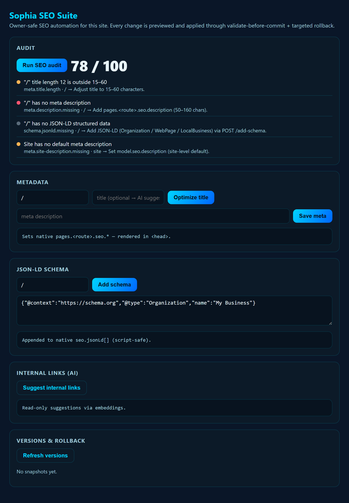
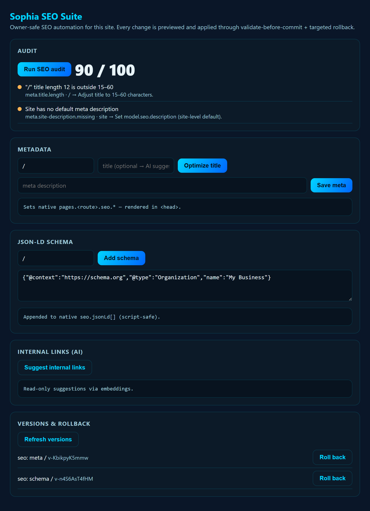

# Sophia SEO Suite

> Modular, self-hosted **SEO/GEO automation** for SophiaXT websites — and any
> future website system — built as a reusable product, **in parallel to**
> [Sophia Stack](https://github.com/Chorozion/Sophia-Stack) (never inside it).

Sophia SEO Suite lets website owners, agencies, and ordinary business owners run
automated SEO **without breaking their websites**. Every automated change goes
through **drafts → preview → approval → publish**, and every publish has a
**rollback path** when the connected site supports it.

The first real target is **Sophia Stack**: the Suite installs as a **Sophia Stack
extension** (`extensions/sophia-stack/`) and runs in-process through the host's
permissioned `ctx` API — reading the Site Model and applying **safe, reversible**
patches (validate-before-commit + rollback + audit, automatic). The same SEO
engine also drives a **platform-agnostic connector interface** (HTTP/mock today)
that is designed to later wrap WordPress, Wix, Webflow, Shopify, and plain
webhooks. See [`docs/extension-integration.md`](docs/extension-integration.md).

---

## Why it's safe by design

SEO tools are dangerous when they edit a live site directly. This suite refuses
to do that. The core safety contract:

| Guardrail | Behavior |
| --- | --- |
| **No direct editing by default** | All changes are proposed as drafts. |
| **Preview before publish** | Owners see a diff/preview of every change. |
| **Draft-first content** | Generated content defaults to `DRAFT`. |
| **Full audit log** | Every automated change is recorded with actor + before/after. |
| **Rollback path** | Publishes are reversible when the connector exposes versioning. |
| **Never destructive** | The connector contract forbids destroying existing content. |

See [`docs/owner-safe-editing.md`](docs/owner-safe-editing.md) and
[`SECURITY.md`](SECURITY.md).

---

## Modules & tiers

Modules are enabled/disabled **by tier**. Full list in
[`docs/modules.md`](docs/modules.md) and [`docs/tiers.md`](docs/tiers.md).

- **Tier 1 — Starter SEO**: site audit, title/meta editor, image alt checker,
  sitemap, robots.txt helper, `llms.txt` generator, basic schema, broken-link &
  heading checkers, local-business checklist.
- **Tier 2 — Growth SEO**: content planner, AI draft/service/landing generators,
  internal-link suggestions, FAQ + JSON-LD builders, publishing queue, weekly
  report. (Search Console connection comes later.)
- **Tier 3 — Agency / SophiaXT Pro**: multi-site dashboard, client management,
  white-label reports, **Sophia Stack connector**, webhook connector,
  role-based permissions, approval workflows. (WordPress/Wix/Webflow/Shopify,
  AI-visibility, and backlink tracking come later.)

---

## Monorepo layout

```
apps/
  dashboard/            Next.js (App Router) owner/agency dashboard shell
extensions/
  sophia-stack/         Installable Sophia Stack extension (the real integration)
packages/
  core/                 SEO engine — audit, crawler, seo, geo, schema,
                        llms-txt, content, reports, permissions
  db/                   Prisma schema + client (PostgreSQL)
  connectors/
    core/               Connector interface + shared types (the contract)
    sophia-stack/       Real-ish connector to Sophia Stack (mock first)
    wordpress/          Stub (future)
    wix/                Stub (future)
    webflow/            Stub (future)
    shopify/            Stub (future)
    webhook/            Stub (future)
  workers/              BullMQ job processors (crawls, audits, reports)
  shared/               Cross-cutting types, tier/module config, env loading
docs/                   Architecture, tiers, modules, security, safe-editing,
                        Sophia Stack analysis + extension requirements
```

---

## Tech stack

TypeScript · Next.js (App Router) · PostgreSQL · Prisma · Redis + BullMQ ·
Playwright + Cheerio (crawling) · Zod (validation) · Tailwind / shadcn (UI) ·
pnpm workspace · Docker Compose (local Postgres + Redis).

---

## Quick start (foundation)

> This repo is in **foundation** stage. Many modules are intentionally stubbed.
> See [`TODO.md`](TODO.md) for what is and isn't built.

```bash
# 1. Install
pnpm install

# 2. Local infra (Postgres + Redis)
cp .env.example .env        # then fill values
pnpm infra:up

# 3. Generate Prisma client (schema draft)
pnpm db:generate

# 4. Run the dashboard shell
pnpm dev
```

### Install into a Sophia Stack site

**One-click (Sophia Stack v1.5+):** in the Stack dashboard, **Extensions → "Add
Sophia SEO Suite"**. The Stack fetches this repo's `extensions/sophia-stack`
directory, validates the manifest + `requires.sophiaStack`, and installs it
non-destructively.

Equivalent owner-session API call:

```bash
curl -X POST <deployment>/api/sophia/extensions/install \
  -H "Content-Type: application/json" \
  -d '{ "repo": "Chorozion/SophiaXT-SEO-Suite", "subdir": "extensions/sophia-stack" }'
```

**Manual (any version / offline):** copy the folder in and enable it —

```bash
cp -r extensions/sophia-stack  <deployment>/.sophia-data/extensions/sophia-seo-suite
# restart the Stack, then enable as owner via the dashboard or:
#   POST /api/sophia/extensions { "id": "sophia-seo-suite", "enabled": true }
```

---

## See it in action

The owner panel, running live inside a Sophia Stack deployment — an SEO audit, then
the score after applying safe fixes (with named versions + one-click rollback):




More: [`docs/v1.5-live-test.md`](docs/v1.5-live-test.md) (full lifecycle verified).

## Relationship to Sophia Stack (read this)

**Sophia Stack is a read-only reference for this project.** We do not modify it.
Findings from inspecting it live in
[`docs/sophia-stack-readonly-analysis.md`](docs/sophia-stack-readonly-analysis.md).
Things Sophia Stack should eventually expose for a clean connection are written
up in
[`docs/sophia-stack-extension-requirements.md`](docs/sophia-stack-extension-requirements.md)
— as **requirements**, not as patches to Sophia Stack.

---

## License

**Proprietary — © 2026 SophiaXT LLC. All rights reserved.** See [`LICENSE`](LICENSE).
**Source-available:** this repository is public so Sophia Stack deployments can
fetch and run the extension via one-click install, and for transparency — but it is
**not** open-source. The source is **not** licensed for redistribution,
modification, or reuse without written permission.
